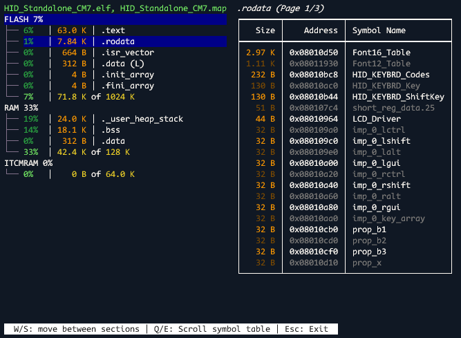

[](https://badge.fury.io/py/nesiac)

# Overview

Nesiac is a terminal tool for visualising memory usage in embedded programs.

As an example when run on the STM32 "HID_Standalone" project for STM32H747I-DISCO board:



# Installation

Nesiac is very early in development, and supports only Windows (currently).

It may be installed with pip via:

`python -m pip install nesiac`

The `nesiac` executable will then be made available in your python executables directory, which should be on your path.

# Usage

Nesiac requires two files to do its analysis:

- An ELF file for section and symbol info
- A map file (in GCC style) for memory region info

If Nesiac is given a single path as argument, that path should be a directory containing exactly one `.elf` and one `.map` file. In that case, Nesiac will use those files for analysis.

Alternatively those paths may be overriden with the `-e,--elf-file` and `-m,--map-file` arguments.

Exporting a map file from GCC may be enabled with the `-Wl,-Map=<FILE>` flag.

If you are using a linker that cannot generate GCC style map files, then you can provide a dummy map file with the region info in the correct format:

```
Memory Configuration

Name             Origin             Length             Attributes
FLASH            0x0000000008000000 0x0000000000100000 xr
RAM              0x0000000024000000 0x0000000000020000 xrw
ITCMRAM          0x0000000000000000 0x0000000000010000 xrw
*default*        0x0000000000000000 0xffffffffffffffff
```
